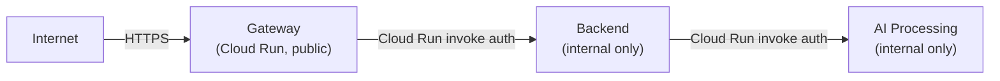

# Security Policy

## Reporting a Vulnerability

If you discover a security vulnerability in Lumineer, **do not open a public GitHub issue.**

Please report it by emailing the maintainer directly (see GitHub profile). Include:

- A description of the vulnerability
- Steps to reproduce
- Potential impact assessment
- Suggested remediation (if any)

You will receive a response within 48 hours. We will work with you to understand and address the issue before any public disclosure.

---

## Security Architecture

### Authentication & Authorization

| Mechanism | Implementation | Details |
|-----------|---------------|---------|
| Password hashing | bcrypt | Cost factor 12 |
| Access tokens | JWT (jose) | 15-minute expiry, HS256 |
| Refresh tokens | JWT (jose) | 7-day expiry, stored client-side |
| Token validation | Hono middleware | Validates signature + expiry on every protected request |
| Session ownership | Row-level check | Sessions/messages checked against `userId` from JWT |

### Network Boundaries

| Service | Access | Production enforcement |
|---------|--------|----------------------|
| Gateway | Public internet | `--allow-unauthenticated` (Cloud Run) |
| Backend | Gateway only | `--no-allow-unauthenticated`, Gateway service account |
| AI Processing | Backend only | `--no-allow-unauthenticated`, Backend service account |
| PostgreSQL | Backend only | Cloud SQL private IP, VPC |
| Qdrant Cloud | AI Processing only | API key required in prod |

### Secret Management

| Secret | Development | Production |
|--------|-------------|-----------|
| `OPENAI_API_KEY` | `.env.local` (gitignored) | GCP Secret Manager → Cloud Run env |
| `QDRANT_API_KEY` | Not needed (local Qdrant) | GCP Secret Manager → Cloud Run env |
| `JWT_SECRET` | `.env.local` | GCP Secret Manager → Cloud Run env |
| `DATABASE_URL` | `.env.local` | GCP Secret Manager → Cloud Run env |

**Rules:**
- `.env.local` is in `.gitignore` — never committed
- `.env.example` lists all variables with empty values (safe to commit)
- `git diff --staged` before every commit to verify no secrets are included
- GCP project ID and Cloud Run URLs are also treated as secrets (stored in GitHub Secrets)

### Input Validation

| Layer | Mechanism |
|-------|-----------|
| API boundary | Zod schemas (`@hono/zod-openapi`) — all requests validated at route level |
| Agent inputs | L1 Input Guardrails (injection detection, toxicity filter, off-topic detection) |
| PII protection | Microsoft Presidio (planned) — mask PII before LLM, unmask in response |
| SQL | Drizzle ORM parameterized queries — no raw SQL string concatenation |

### Dependency Security

- TypeScript dependencies: `bun audit` before releases
- Python dependencies: `uv` lock file, `pip-audit` before releases
- Docker images: non-root user, minimal base images
- Dependabot enabled on the repository for automated dependency updates

---

## OWASP Top 10 Mitigations

| Risk | Mitigation |
|------|-----------|
| **A01 Broken Access Control** | JWT middleware on all protected routes; row-level session ownership checks |
| **A02 Cryptographic Failures** | bcrypt for passwords; HTTPS enforced via Cloud Run; JWT signed with strong secret |
| **A03 Injection** | Zod validation at all API boundaries; Drizzle ORM parameterized queries; prompt injection detection in L1 guardrail |
| **A04 Insecure Design** | Clean Architecture separates concerns; Port/Adapter abstracts external deps; secrets never in code |
| **A05 Security Misconfiguration** | Pydantic Settings validates all required env vars at startup; Backend/AI are internal-only by default |
| **A06 Vulnerable Components** | Lock files for reproducible installs; automated dependency auditing planned |
| **A07 Auth Failures** | Short-lived access tokens (15m); rate limiting on auth endpoints (Gateway); bcrypt cost 12 |
| **A08 Data Integrity Failures** | Zod / Pydantic strict validation; no user-supplied data in exec/eval calls |
| **A09 Logging Failures** | Structured logging via Langfuse (LLM events) and Prometheus (infra metrics) |
| **A10 Server-Side Request Forgery** | AI Processing only communicates with Qdrant and OpenAI (no user-controlled URLs) |

---

## LLM-Specific Risks

| Risk | Mitigation |
|------|-----------|
| Prompt injection | `injection_detector` guardrail blocks known patterns at L1 |
| Jailbreaking | Persona lock in agent prompts; output guardrail validates faithfulness |
| Hallucination | Hallucination checker (L4) validates course names against retrieved set |
| Off-topic abuse | `offtopic_detector` guardrail (skeleton, full LLM-based impl planned) |
| Denial of Wallet | `AGENT_MAX_TURNS` limit (default 10); Corrective RAG max retry limit; rate limiting at Gateway |
| PII leakage | Presidio PII masking before LLM submission (planned, see roadmap) |

---

## Security Roadmap

Items planned but not yet implemented:

- [ ] Full LLM-based `toxicity_filter` (currently pass-through skeleton)
- [ ] Full LLM-based `offtopic_detector` (currently pass-through skeleton)
- [ ] Full 2-stage `hallucination_checker` (DB lookup + LLM verifier)
- [ ] Microsoft Presidio PII masking on LLM inputs
- [ ] Refresh token rotation (invalidate old on use)
- [ ] Auth endpoint rate limiting with exponential backoff
- [ ] Automated `pip-audit` / `bun audit` in CI
