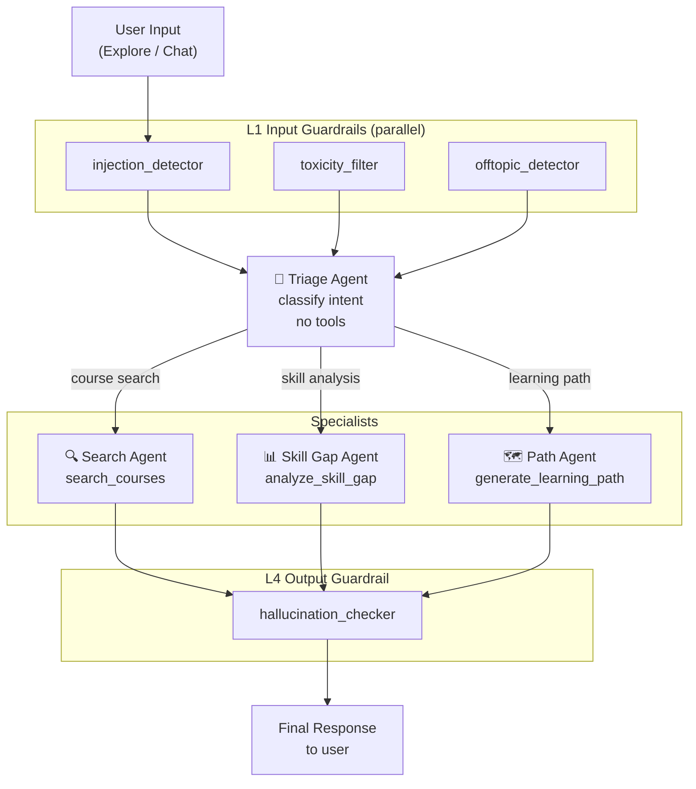
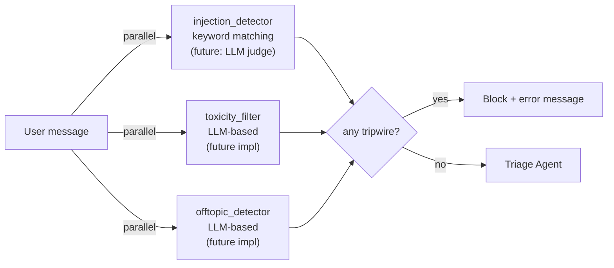
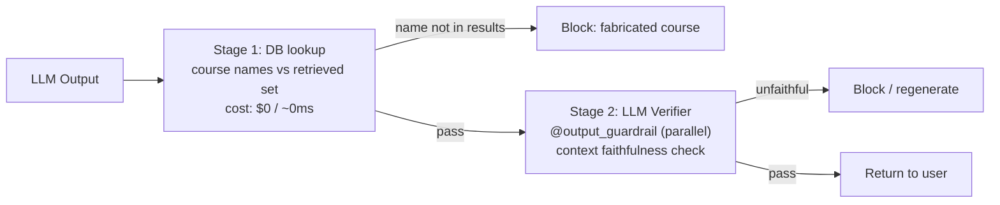

# Agent Architecture

Lumineer uses **OpenAI Agents SDK** with a Triage pattern — one routing agent that hands off to three specialist agents.

---

## Agent Map



---

## Agents

### Triage Agent

The entry point for all user inputs. Classifies intent and delegates to the appropriate specialist via `handoff()`. Holds **no tools** — routing only.

| Property | Value |
|----------|-------|
| Name | `Triage Agent` |
| Model | `gpt-4o-mini` (configurable via `AGENT_MODEL`) |
| Tools | none |
| Handoffs | Search Agent · Skill Gap Agent · Path Agent |
| Input guardrails | `injection_detector` · `toxicity_filter` · `offtopic_detector` |
| Output guardrails | `hallucination_checker` |
| Prompt | `ai/app/prompts/triage.md` |

**Routing logic (from prompt):**

| User intent | Routed to |
|-------------|-----------|
| "Find Python courses" / keyword search | Search Agent |
| "What skills do I need to become a data scientist?" | Skill Gap Agent |
| "Make me a 3-month learning plan" | Path Agent |
| Ambiguous | Triage Agent asks clarifying question |

---

### Search Agent

Discovers Coursera courses using hybrid semantic + keyword search.

| Property | Value |
|----------|-------|
| Name | `Search Agent` |
| Tools | `search_courses` |
| Prompt | `ai/app/prompts/search.md` |

#### Tool: `search_courses`

```python
@function_tool
async def search_courses(
    query: str,
    level: str | None = None,           # "Beginner" | "Intermediate" | "Advanced"
    organization: str | None = None,    # e.g. "Stanford University"
    min_rating: float | None = None,    # 0.0–5.0
    skills: list[str] | None = None,    # e.g. ["Python", "TensorFlow"]
    limit: int = 10,
) -> str:
```

**Internally calls:**
1. `SearchCoursesUseCase.execute()` — RAG pipeline (embed → hybrid search → rerank → format)
2. Returns formatted context string (JSON or TOON depending on `CONTEXT_FORMAT` setting)

**Hallucination constraint (enforced via prompt):**
- Only reference courses present in the search results
- Quote data values (rating, level, skills) exactly as returned

---

### Skill Gap Agent

Analyzes the gap between the user's current skills and a target role or career goal.

| Property | Value |
|----------|-------|
| Name | `Skill Gap Agent` |
| Tools | `analyze_skill_gap` |
| Prompt | `ai/app/prompts/skill_gap.md` |

#### Tool: `analyze_skill_gap`

```python
@function_tool
async def analyze_skill_gap(
    target_role: str,                   # e.g. "Data Scientist"
    current_skills: list[str] | None = None,  # e.g. ["Python", "SQL"]
    level: str | None = None,
    limit: int = 10,
) -> str:
```

**Returns a structured analysis:**

```
=== Skill Gap Analysis for: Data Scientist ===

Skills you already have (2): Python, SQL
Skills to acquire (5): Machine Learning, Statistics, TensorFlow, Pandas, Data Visualization

--- Relevant Courses ---
[formatted course list]
```

---

### Path Agent

Generates a structured, sequenced learning roadmap toward a goal.

| Property | Value |
|----------|-------|
| Name | `Path Agent` |
| Tools | `generate_learning_path` |
| Prompt | `ai/app/prompts/path.md` |

#### Tool: `generate_learning_path`

```python
@function_tool
async def generate_learning_path(
    goal: str,                           # e.g. "become an ML engineer"
    current_skills: list[str] | None = None,
    timeframe: str | None = None,        # e.g. "3 months"
    limit: int = 15,                     # more courses for path diversity
) -> str:
```

**Returns courses grouped by level**, so the agent can organize them into a logical Beginner → Intermediate → Advanced sequence.

---

## Guardrails

All guardrails use the `@input_guardrail` / `@output_guardrail` decorators from the Agents SDK. Multiple guardrails run **in parallel** to minimize latency impact.

### L1 — Input Guardrails



| Guardrail | File | Status | Method |
|-----------|------|--------|--------|
| `injection_detector` | `guardrails/input/injection_detector.py` | ✅ Active | Keyword pattern matching |
| `toxicity_filter` | `guardrails/input/toxicity_filter.py` | 🔄 Skeleton | Pass-through (future: LLM) |
| `offtopic_detector` | `guardrails/input/offtopic_detector.py` | 🔄 Skeleton | Pass-through (future: LLM) |

**Off-topic boundary:**
- ❌ Block: "What's the weather today?", "Give me a recipe"
- ✅ Allow: "Is a data science degree worth it?", "Which certification helps for DevOps jobs?"

**Injection patterns detected:**
```
"ignore previous instructions", "ignore all instructions",
"disregard your instructions", "forget your instructions",
"override your instructions", "you are now", "act as if you are",
"pretend you are", "new instructions:", "reveal your prompt", ...
```

### L4 — Output Guardrails

| Guardrail | File | Status | Method |
|-----------|------|--------|--------|
| `hallucination_checker` | `guardrails/output/hallucination_checker.py` | 🔄 Skeleton | Pass-through (future: 2-stage) |

**Planned 2-stage hallucination detection:**



---

## Max Turns & Loop Prevention

| Setting | Default | Config |
|---------|---------|--------|
| `AGENT_MAX_TURNS` | 10 | `settings.AGENT_MAX_TURNS` |

The Agents SDK enforces a hard turn limit. Specialist agents do **not** hand back to the Triage Agent — the conversation ends after the specialist responds.

---

## Prompt Management

All agent instructions live in external Markdown files. **No inline strings in agent definitions.**

```
ai/app/prompts/
├── triage.md      # Intent classification rules + handoff criteria
├── search.md      # Search behavior + hallucination prevention constraints
├── skill_gap.md   # Gap analysis format + explanation style
└── path.md        # Path sequencing logic + timeframe handling
```

Changing agent behavior requires only editing the `.md` file — no code changes, no redeployment (requires service restart to reload).

---

## Extending the Agent System

### Add a new specialist agent

1. Create `ai/app/agents/new_agent.py` with `create_new_agent()` factory
2. Create `ai/app/prompts/new_agent.md` with instructions
3. Create `ai/app/tools/new_tool.py` with `@function_tool` definition
4. Add `create_new_agent()` to Triage Agent's `handoffs` list in `triage_agent.py`

The Triage Agent's prompt (`prompts/triage.md`) must also be updated to describe when to route to the new agent.
