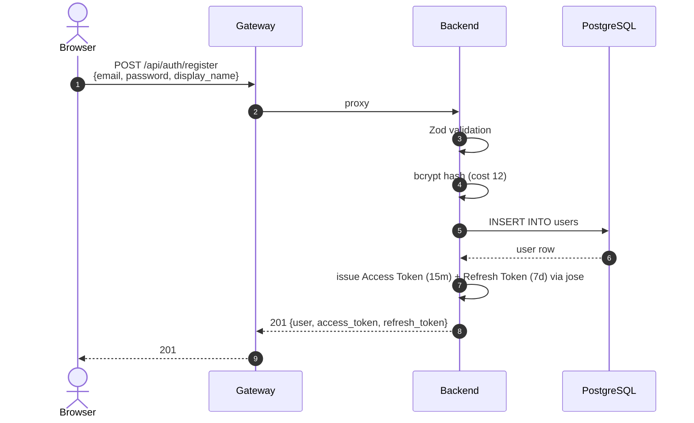
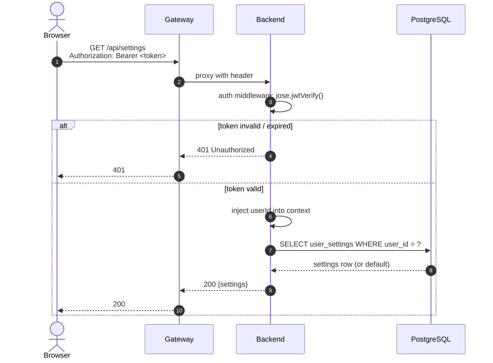
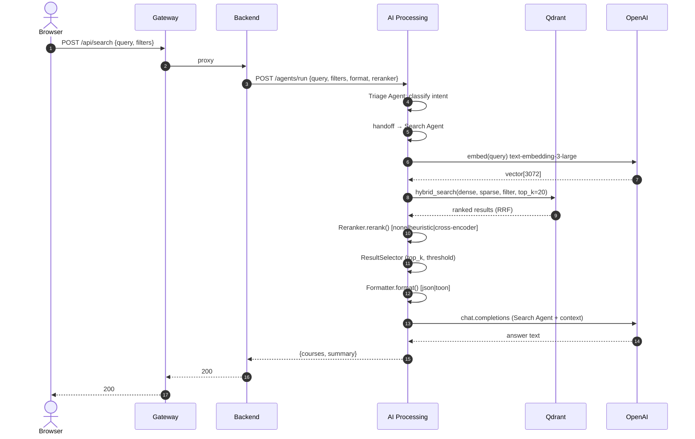
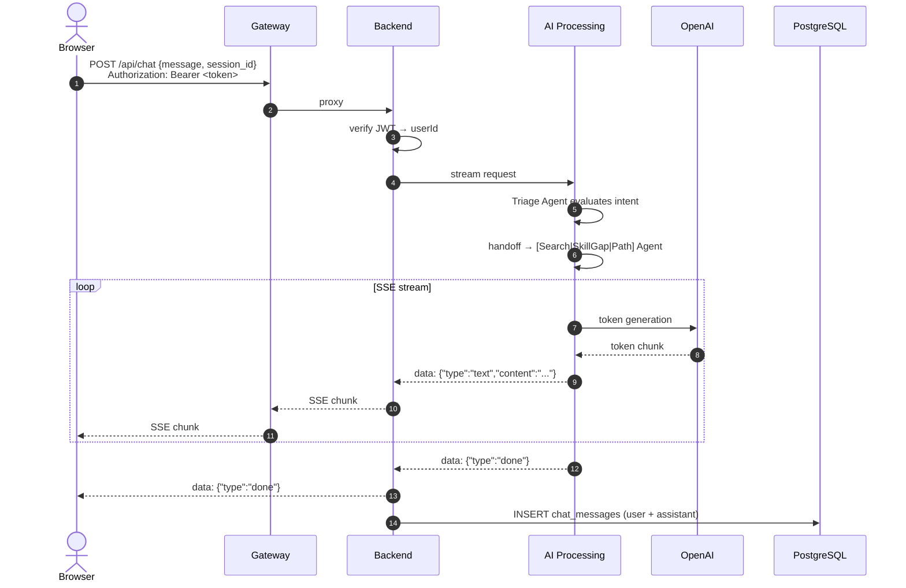
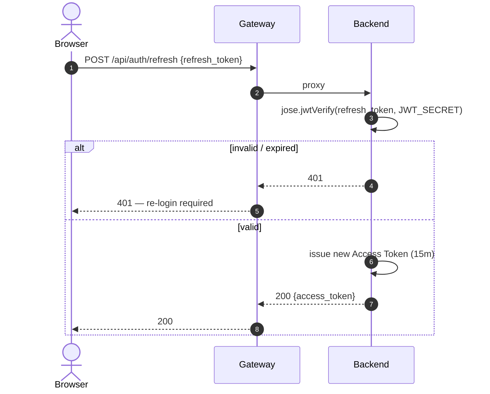
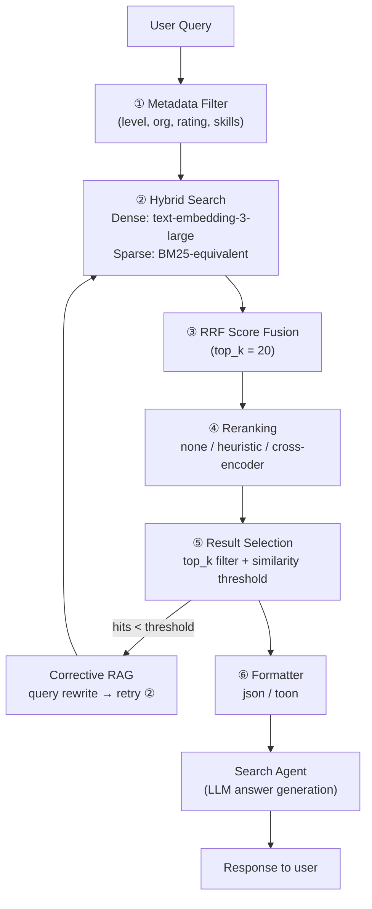
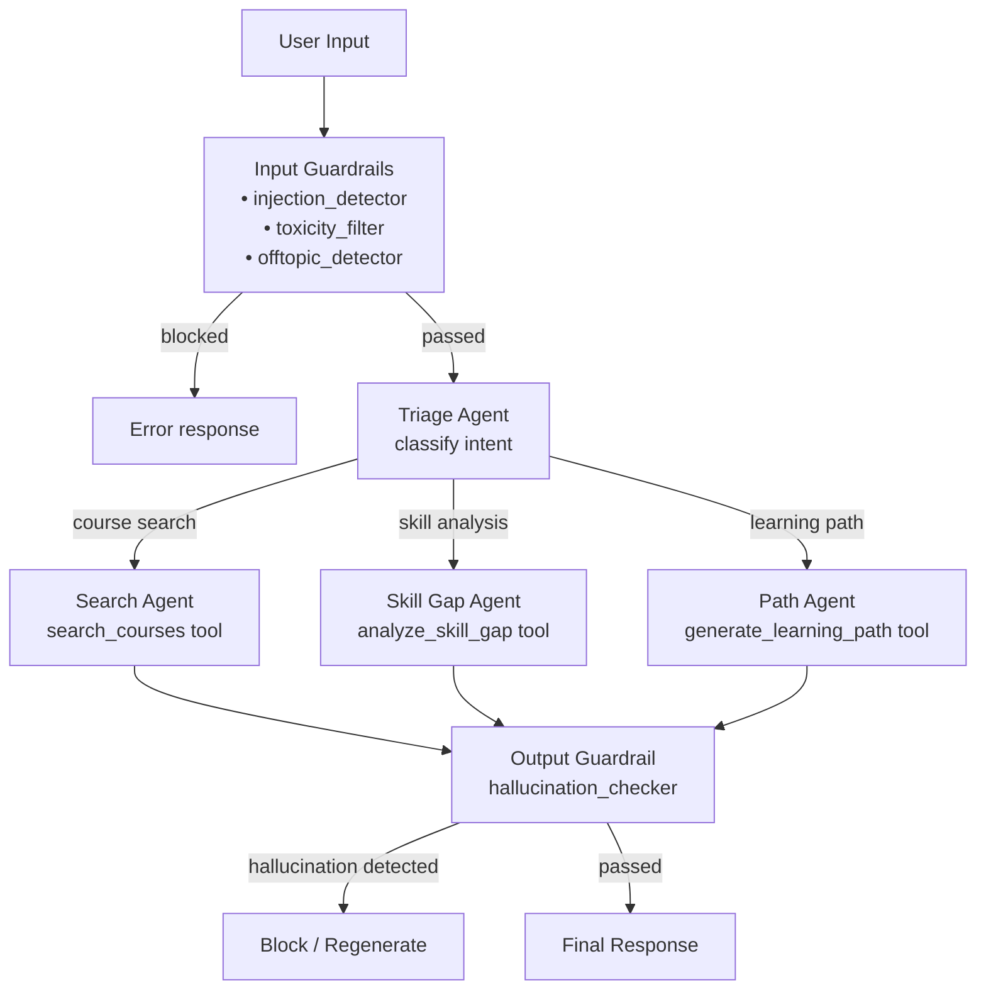
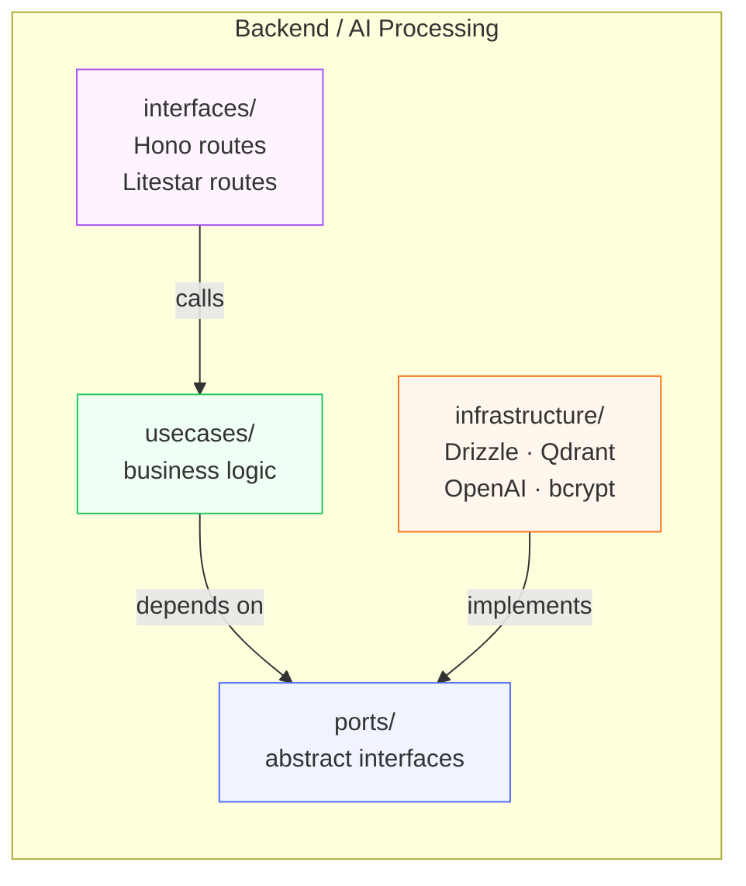
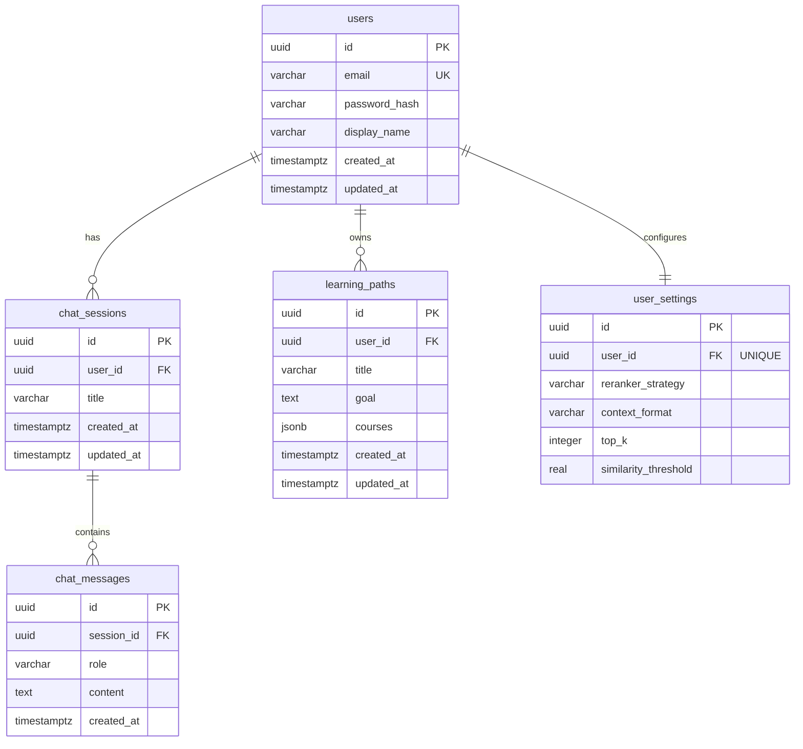
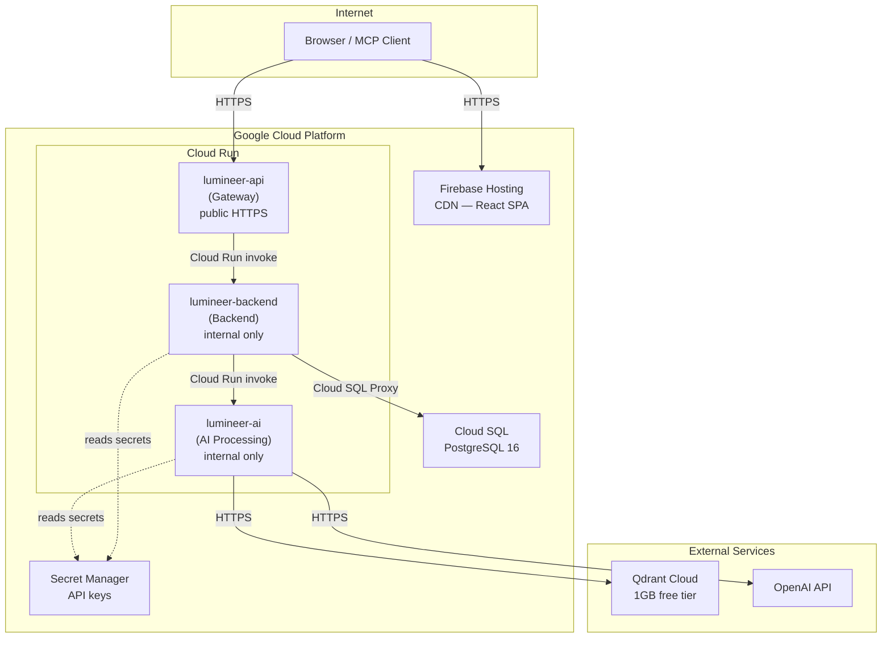

# System Architecture

## 1. System Architecture Diagram

> **Source file:** [`docs/diagrams/system-architecture.drawio`](diagrams/system-architecture.drawio)
>
> Open with [draw.io desktop app](https://github.com/jgraph/drawio-desktop/releases) or the [VS Code extension](https://marketplace.visualstudio.com/items?itemName=hediet.vscode-drawio).

The diagram covers all 4 layers (Frontend → Gateway → Backend → AI Processing), external services (Qdrant Cloud, OpenAI API), observability stack, security boundaries, and production cost breakdown.

**Layer summary:**

| Layer | Tech | Port | Deployment |
|-------|------|------|-----------|
| Frontend | React + Vite + Shadcn UI | 5173 | Firebase Hosting (CDN) |
| Gateway | Bun + Hono | 3000 | Cloud Run (public) |
| Backend | Bun + Hono + Drizzle | 3001 | Cloud Run (internal) |
| AI Processing | Python + Litestar + Agents SDK | 8001 | Cloud Run (internal) |
| PostgreSQL | PostgreSQL 16 | 5432 | Cloud SQL |
| Qdrant | Vector DB | 6333 | Qdrant Cloud (1 GB free) |

**Dependency flow:** `Frontend → Gateway → Backend → AI Processing → Qdrant / OpenAI`

---

## 2. Sequence Diagrams

### 3-1. User Registration

### 3-2. JWT-Authenticated Request

### 3-3. AI Course Search (Explore page)

### 3-4. Chat with SSE Streaming

### 3-5. Token Refresh

---

## 4. RAG Pipeline Flow

---

## 5. Agent Handoff Flow

---

## 6. Clean Architecture — Dependency Rule

**Rule:** arrows point inward only. `infrastructure/` depends on `ports/`, never vice versa. Swapping Qdrant for another vector DB means touching only `infrastructure/vectordb/`.

---

## 7. PostgreSQL ER Diagram

---

## 8. Production Infrastructure (GCP)

**Access control:**
- Gateway (`lumineer-api`): `allUsers` — public HTTPS
- Backend (`lumineer-backend`): Gateway service account only
- AI Processing (`lumineer-ai`): Backend service account only

---

## 9. Technology Decisions

Key architecture decisions are recorded in [docs/adr.md](adr.md).

| ADR | Decision |
|-----|---------|
| ADR-001 | Modular monolith + Docker Compose (not microservices) |
| ADR-002 | Clean Architecture for Backend and AI Processing |
| ADR-003 | Bun + Hono for API layer |
| ADR-004 | Python + Litestar for AI Processing |
| ADR-005 | OpenAI Agents SDK (no LangChain) |
| ADR-007 | Qdrant as vector DB (hybrid search native) |
| ADR-010 | Triage pattern — 4-agent handoff architecture |
| ADR-013 | Dedicated API Gateway layer |
