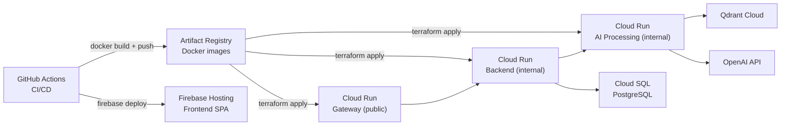
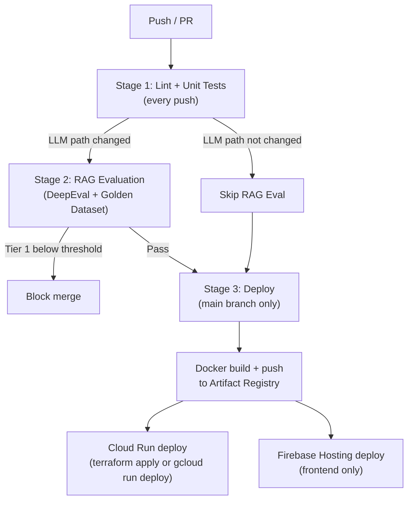

# Deployment Guide

Lumineer runs on **GCP Cloud Run** (Backend + AI Processing) + **Firebase Hosting** (Frontend) + **Qdrant Cloud** (Vector DB).

---

## Prerequisites

- GCP project with billing enabled
- [gcloud CLI](https://cloud.google.com/sdk/docs/install) authenticated
- [Terraform](https://developer.hashicorp.com/terraform/install) ≥ 1.5
- [Firebase CLI](https://firebase.google.com/docs/cli) authenticated
- Docker
- Secrets: `OPENAI_API_KEY`, `QDRANT_URL`, `QDRANT_API_KEY`, `JWT_SECRET`, `DATABASE_URL`

---

## Architecture Overview



---

## Step 1 — Initial Setup (one-time)

### 1-1. Configure Terraform

```bash
cd infra
cp terraform.tfvars.example terraform.tfvars
```

Edit `terraform.tfvars`:

```hcl
project_id    = "your-gcp-project-id"
region        = "asia-northeast1"  # Tokyo
api_image     = "asia-northeast1-docker.pkg.dev/<project>/lumineer/gateway:latest"
ai_image      = "asia-northeast1-docker.pkg.dev/<project>/lumineer/ai:latest"
```

### 1-2. Store secrets in GCP Secret Manager

```bash
# Create secrets (values are injected by Terraform, just create the resources)
gcloud secrets create openai-api-key --replication-policy="automatic"
gcloud secrets create qdrant-url --replication-policy="automatic"
gcloud secrets create qdrant-api-key --replication-policy="automatic"
gcloud secrets create jwt-secret --replication-policy="automatic"
gcloud secrets create database-url --replication-policy="automatic"

# Add secret values
echo -n "sk-..." | gcloud secrets versions add openai-api-key --data-file=-
echo -n "https://your-cluster.qdrant.io" | gcloud secrets versions add qdrant-url --data-file=-
# ... repeat for other secrets
```

### 1-3. Apply Terraform

```bash
cd infra
terraform init
terraform plan
terraform apply
```

This provisions:
- Cloud Run services (Gateway, Backend, AI Processing)
- IAM bindings (service-to-service auth)
- Artifact Registry repositories
- Firebase project linkage

### 1-4. Configure GitHub Secrets

Add to **GitHub → Settings → Secrets and variables → Actions**:

| Secret | Value |
|--------|-------|
| `GCP_PROJECT_ID` | Your GCP project ID |
| `GCP_SA_KEY` | Service account JSON key for CI/CD |
| `GATEWAY_URL` | Cloud Run URL for Gateway |

---

## Step 2 — Build and Push Docker Images

### Gateway + Backend (same image, different entry points)

```bash
docker build -t asia-northeast1-docker.pkg.dev/<project>/lumineer/gateway:latest \
  --target gateway ./gateway

docker build -t asia-northeast1-docker.pkg.dev/<project>/lumineer/backend:latest \
  --target backend ./backend

docker push asia-northeast1-docker.pkg.dev/<project>/lumineer/gateway:latest
docker push asia-northeast1-docker.pkg.dev/<project>/lumineer/backend:latest
```

### AI Processing

```bash
docker build -t asia-northeast1-docker.pkg.dev/<project>/lumineer/ai:latest ./ai
docker push asia-northeast1-docker.pkg.dev/<project>/lumineer/ai:latest
```

---

## Step 3 — Deploy Services

### Deploy via Terraform (recommended)

```bash
cd infra
terraform apply -var="api_image=...:<new-tag>" -var="ai_image=...:<new-tag>"
```

### Deploy manually (quick update)

```bash
# Gateway
gcloud run deploy lumineer-api \
  --image asia-northeast1-docker.pkg.dev/<project>/lumineer/gateway:latest \
  --region asia-northeast1

# Backend (internal)
gcloud run deploy lumineer-backend \
  --image asia-northeast1-docker.pkg.dev/<project>/lumineer/backend:latest \
  --region asia-northeast1 \
  --no-allow-unauthenticated

# AI Processing (internal)
gcloud run deploy lumineer-ai \
  --image asia-northeast1-docker.pkg.dev/<project>/lumineer/ai:latest \
  --region asia-northeast1 \
  --no-allow-unauthenticated
```

---

## Step 4 — Deploy Frontend

```bash
cd frontend
bun run build

# Deploy to Firebase Hosting
firebase deploy --only hosting
```

---

## Step 5 — Run Database Migrations

```bash
# Connect via Cloud SQL Auth Proxy (recommended)
cloud_sql_proxy -instances=<project>:asia-northeast1:lumineer-pg=tcp:5432 &

DATABASE_URL="postgres://..." cd backend && bun run db:migrate
```

---

## Step 6 — Seed Qdrant (one-time)

Run the ingestion script pointing at Qdrant Cloud:

```bash
cd ai
QDRANT_URL=https://your-cluster.qdrant.io \
QDRANT_API_KEY=your-key \
OPENAI_API_KEY=sk-... \
APP_ENV=prod \
uv run python scripts/seed_data.py
```

Estimated time: 15–30 minutes. Cost: ~$1.36.

---

## CI/CD Pipeline (GitHub Actions)

The pipeline runs automatically on push to `develop` and `main`.



---

## Environment Variables Reference

### Gateway (Cloud Run)

| Variable | Value |
|----------|-------|
| `PORT` | `3000` |
| `BACKEND_URL` | Backend Cloud Run URL (set by Terraform) |
| `ALLOWED_ORIGINS` | Firebase Hosting URL |

### Backend (Cloud Run)

| Variable | Source |
|----------|--------|
| `APP_ENV` | `prod` |
| `PORT` | `3001` |
| `DATABASE_URL` | Secret Manager |
| `JWT_SECRET` | Secret Manager |
| `AI_SERVICE_URL` | AI Processing Cloud Run URL (set by Terraform) |

### AI Processing (Cloud Run)

| Variable | Source |
|----------|--------|
| `APP_ENV` | `prod` |
| `PORT` | `8001` |
| `OPENAI_API_KEY` | Secret Manager |
| `QDRANT_URL` | Secret Manager |
| `QDRANT_API_KEY` | Secret Manager |

---

## Cold Start Mitigation

Cloud Run scales to zero by default. Cold starts affect the demo experience:

| Service | Cold start time | Mitigation |
|---------|----------------|-----------|
| Gateway (Bun) | ~1–2 seconds | Acceptable |
| Backend (Bun) | ~1–2 seconds | Acceptable |
| AI Processing (Python + ML libs) | ~5–15 seconds | Set `min-instances=1` for demo |

```bash
# Keep AI Processing warm during demo
gcloud run services update lumineer-ai \
  --min-instances=1 \
  --region=asia-northeast1
```

Remember to set back to 0 after the demo to avoid charges.

---

## Rollback

```bash
# List recent revisions
gcloud run revisions list --service=lumineer-api --region=asia-northeast1

# Route traffic back to a previous revision
gcloud run services update-traffic lumineer-api \
  --to-revisions=lumineer-api-00010-xyz=100 \
  --region=asia-northeast1
```

---

## Cost Estimate

| Resource | Monthly cost |
|----------|-------------|
| Cloud Run (all services, free tier) | $0 |
| Firebase Hosting | $0 |
| Qdrant Cloud (1 GB free tier) | $0 |
| Cloud SQL (minimal instance) | $7–9 |
| OpenAI GPT-4o-mini | ~$5 |
| OpenAI Embeddings (ingestion, one-time) | ~$0.26 |
| **Total** | **~$12–14/month** |

To eliminate Cloud SQL cost, use a free PostgreSQL provider (e.g. Neon) and set `DATABASE_URL` accordingly.
