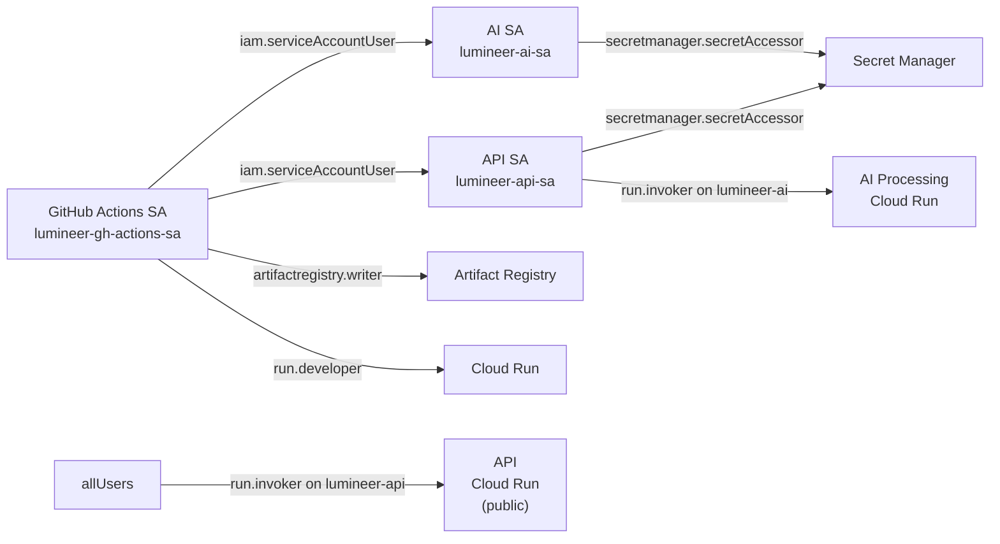
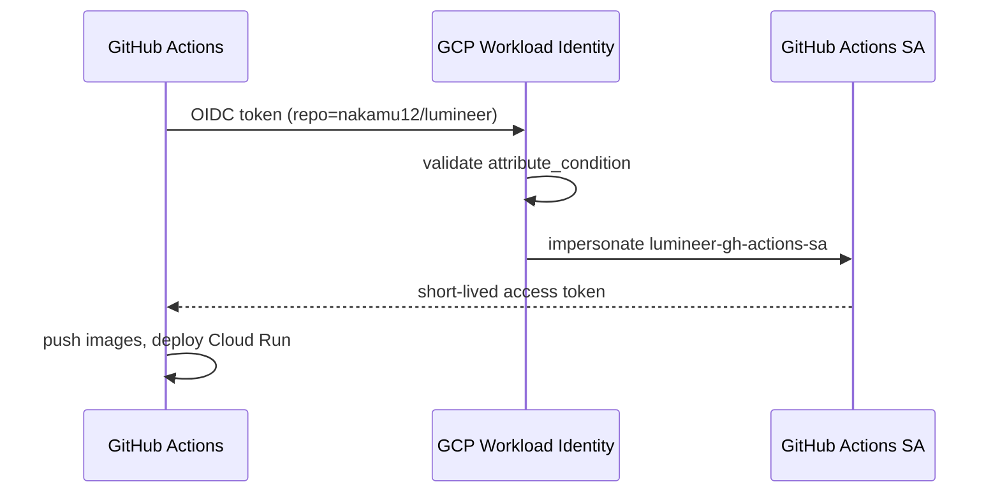

# Infrastructure Reference

Lumineer uses Terraform to manage all GCP infrastructure as code. This document covers the resource inventory, Terraform variable reference, and operational procedures.

---

## Resource Inventory

| Resource | Name | Type | Purpose |
|----------|------|------|---------|
| Cloud Run service | `lumineer-api` | `google_cloud_run_v2_service` | Gateway (public HTTPS) |
| Cloud Run service | `lumineer-ai` | `google_cloud_run_v2_service` | AI Processing (internal) |
| Artifact Registry | `lumineer-images` | `google_artifact_registry_repository` | Docker image store |
| Service Account | `lumineer-api-sa` | `google_service_account` | Identity for Gateway |
| Service Account | `lumineer-ai-sa` | `google_service_account` | Identity for AI Processing |
| Service Account | `lumineer-gh-actions-sa` | `google_service_account` | CI/CD identity |
| Secret | `lumineer-openai-api-key` | `google_secret_manager_secret` | OpenAI API key |
| Secret | `lumineer-qdrant-url` | `google_secret_manager_secret` | Qdrant Cloud URL |
| Secret | `lumineer-qdrant-api-key` | `google_secret_manager_secret` | Qdrant Cloud API key |
| WIF Pool | `lumineer-github-pool` | `google_iam_workload_identity_pool` | Keyless auth for GitHub Actions |
| Firebase (managed externally) | — | Firebase Hosting | Frontend CDN |

> Cloud SQL is **not managed by Terraform** in the current setup. Use a free PostgreSQL provider (e.g., [Neon](https://neon.tech)) and inject `DATABASE_URL` directly into the Backend service environment.

---

## Terraform Directory

```
infra/
├── provider.tf          # Google provider + required_providers
├── variables.tf         # All input variables with defaults and validation
├── cloud_run.tf         # Cloud Run services (API + AI) + GCP API enablement
├── iam.tf               # Service accounts, IAM bindings, Workload Identity Federation
├── secrets.tf           # Secret Manager resources (slots only — values set manually)
├── firebase.tf          # Firebase Hosting linkage
├── outputs.tf           # Useful output values (URLs, SA emails, AR URL)
└── terraform.tfvars.example   # Template — copy to terraform.tfvars
```

> `terraform.tfvars` is `.gitignored`. Never commit it.

---

## Variables Reference

### Required (must be set in `terraform.tfvars`)

| Variable | Type | Description |
|----------|------|-------------|
| `project_id` | `string` | GCP project ID |
| `api_image` | `string` | Docker image for Gateway (e.g. `asia-northeast1-docker.pkg.dev/<project>/lumineer-images/lumineer-api:latest`) |
| `ai_image` | `string` | Docker image for AI Processing |

### Optional (have defaults)

| Variable | Default | Description |
|----------|---------|-------------|
| `region` | `"asia-northeast1"` | GCP region for all Cloud Run services |
| `app_name` | `"lumineer"` | Prefix for all resource names |
| `environment` | `"prod"` | `"dev"` or `"prod"` |
| `api_min_instances` | `0` | Min instances for Gateway (set to `1` for demos) |
| `api_max_instances` | `3` | Max instances for Gateway |
| `api_memory` | `"512Mi"` | Memory per Gateway instance |
| `api_cpu` | `"1"` | vCPU per Gateway instance |
| `ai_min_instances` | `0` | Min instances for AI Processing |
| `ai_max_instances` | `2` | Max instances for AI Processing |
| `ai_memory` | `"2Gi"` | Memory per AI Processing instance (needs more for ML libs) |
| `ai_cpu` | `"2"` | vCPU per AI Processing instance |
| `firebase_location` | `"asia-east1"` | Firebase Hosting location |

### Example `terraform.tfvars`

```hcl
project_id  = "my-gcp-project-123"
region      = "asia-northeast1"
environment = "prod"

api_image = "asia-northeast1-docker.pkg.dev/my-gcp-project-123/lumineer-images/lumineer-api:latest"
ai_image  = "asia-northeast1-docker.pkg.dev/my-gcp-project-123/lumineer-images/lumineer-ai:latest"

# Demo warm-up: uncomment to keep services warm
# api_min_instances = 1
# ai_min_instances  = 1
```

---

## Terraform Outputs

After `terraform apply`, the following values are printed:

| Output | Description | Use |
|--------|-------------|-----|
| `api_service_url` | Cloud Run URL for Gateway | Set as `GATEWAY_URL` in GitHub Secrets |
| `ai_service_url` | Cloud Run URL for AI Processing | Set automatically as `AI_SERVICE_URL` env var on API |
| `api_service_account_email` | SA email for Gateway | Reference in IAM grants |
| `ai_service_account_email` | SA email for AI Processing | Reference in IAM grants |
| `artifact_registry_url` | Base URL for Docker pushes | Use as image prefix in CI/CD |
| `workload_identity_provider` | WIF provider resource name | Set as `WIF_PROVIDER` in GitHub Secrets |
| `github_actions_service_account` | GitHub Actions SA email | Set as `WIF_SERVICE_ACCOUNT` in GitHub Secrets |
| `secret_names` | Map of secret resource names | For manual value injection after apply |

---

## IAM Design



**Key principle**: AI Processing is only callable by the API service account. It is not directly accessible from the internet.

---

## Workload Identity Federation (Keyless GitHub Actions)

GitHub Actions authenticates to GCP without a stored service account key, using OIDC tokens from GitHub's identity provider.



**GitHub Secrets required for CI/CD:**

| Secret | Value |
|--------|-------|
| `WIF_PROVIDER` | `projects/.../locations/global/workloadIdentityPools/lumineer-github-pool/providers/github-provider` |
| `WIF_SERVICE_ACCOUNT` | `lumineer-gh-actions-sa@<project>.iam.gserviceaccount.com` |
| `GCP_PROJECT_ID` | GCP project ID |
| `GATEWAY_URL` | Cloud Run URL for Gateway (from `api_service_url` output) |

---

## Secret Manager

Terraform creates the **secret resource slots** but does NOT set values. Values must be injected manually after the first `terraform apply`.

```bash
# Set secret values after terraform apply
echo -n "sk-proj-..." | gcloud secrets versions add lumineer-openai-api-key --data-file=-
echo -n "https://your-cluster.qdrant.io" | gcloud secrets versions add lumineer-qdrant-url --data-file=-
echo -n "your-qdrant-api-key" | gcloud secrets versions add lumineer-qdrant-api-key --data-file=-
```

Secrets are mounted as environment variables in Cloud Run containers via `value_source.secret_key_ref` (see `infra/cloud_run.tf`). The services never read secrets from files or directly from the Terraform state.

---

## Cloud Run Configuration Details

### Gateway (`lumineer-api`)

| Setting | Value | Notes |
|---------|-------|-------|
| Port | `3000` | Hono server port |
| Concurrency | default (80) | |
| CPU policy | `cpu_idle = true` | CPU only allocated during requests |
| `startup_cpu_boost` | `true` | Faster cold starts |
| Liveness probe | `GET /health` every 30s | |
| Startup probe | `GET /health` up to 50s | |
| IAM | `allUsers` → `run.invoker` | Publicly accessible |

### AI Processing (`lumineer-ai`)

| Setting | Value | Notes |
|---------|-------|-------|
| Port | `8001` | Litestar server port |
| Memory | `2Gi` | Required for ML libraries |
| vCPU | `2` | Faster inference |
| CPU policy | `cpu_idle = true` | |
| Liveness probe | `GET /health` every 30s, after 15s initial delay | Python startup is slower |
| Startup probe | `GET /health` up to 200s | Allows for full cold start |
| IAM | `lumineer-api-sa` only | Not publicly accessible |

---

## Firebase Hosting

The frontend (React SPA) is deployed to Firebase Hosting via the Firebase CLI. Terraform links the Firebase project to GCP but does not manage Firebase Hosting deployments directly.

```bash
# Deploy frontend to Firebase Hosting (run from frontend/)
bun run build
firebase deploy --only hosting
```

Firebase Hosting configuration is in `frontend/firebase.json` and `frontend/.firebaserc`.

---

## Terraform Operations Reference

### First-time Setup

```bash
cd infra

# Copy and edit variables
cp terraform.tfvars.example terraform.tfvars
# Edit terraform.tfvars with your project_id and image URLs

# Initialize providers
terraform init

# Preview changes
terraform plan

# Apply infrastructure
terraform apply
```

### Updating Services

```bash
# Update with new image tags
terraform apply \
  -var="api_image=asia-northeast1-docker.pkg.dev/<project>/lumineer-images/lumineer-api:<new-tag>" \
  -var="ai_image=asia-northeast1-docker.pkg.dev/<project>/lumineer-images/lumineer-ai:<new-tag>"
```

### Scaling for Demo

```bash
# Keep AI warm during presentation
terraform apply \
  -var="ai_min_instances=1"

# Reset after demo
terraform apply \
  -var="ai_min_instances=0"
```

### Inspecting State

```bash
# List all managed resources
terraform state list

# Show a specific resource
terraform state show google_cloud_run_v2_service.api

# Show all outputs
terraform output
```

### Destroying Infrastructure

```bash
# Destroy all managed resources (IRREVERSIBLE — use with caution)
terraform destroy
```

> Note: Destroying removes Cloud Run services, Artifact Registry, IAM resources, and Secret Manager slots. Secret **values** are deleted along with the secrets. Back up any secrets before destroying.

---

## Docker Image Build and Push

CI/CD handles this automatically on push to `main`. For manual builds:

```bash
# Authenticate to Artifact Registry
gcloud auth configure-docker asia-northeast1-docker.pkg.dev

# Build and push Gateway
docker build -t asia-northeast1-docker.pkg.dev/<project>/lumineer-images/lumineer-api:latest \
  ./gateway
docker push asia-northeast1-docker.pkg.dev/<project>/lumineer-images/lumineer-api:latest

# Build and push AI Processing
docker build -t asia-northeast1-docker.pkg.dev/<project>/lumineer-images/lumineer-ai:latest \
  ./ai
docker push asia-northeast1-docker.pkg.dev/<project>/lumineer-images/lumineer-ai:latest
```

---

## Cost Breakdown

| Resource | Billing model | Monthly estimate |
|----------|--------------|-----------------|
| Cloud Run (all) | Per request + CPU/memory during requests | $0 (free tier: 2M req, 180K vCPU-sec) |
| Artifact Registry | Per GB stored | $0 (< 0.5 GB) |
| Secret Manager | Per API access | $0 (< 10K accesses/month) |
| Firebase Hosting | Per GB storage + transfer | $0 (free tier) |
| Qdrant Cloud | Per GB stored | $0 (1GB free tier) |
| OpenAI GPT-4o-mini | Per token | ~$5 |
| WIF / IAM | Included in GCP | $0 |
| **Total** | | **~$5–6/month** |

Cloud SQL is **not included** — use a free Postgres provider (Neon, Supabase) and inject `DATABASE_URL` into the Backend environment to keep costs at $0.
