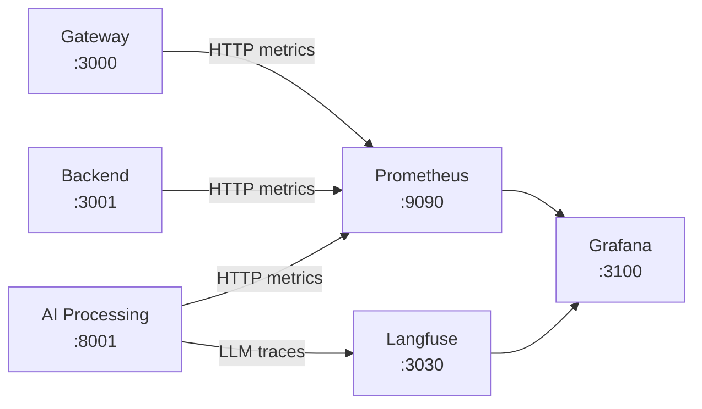
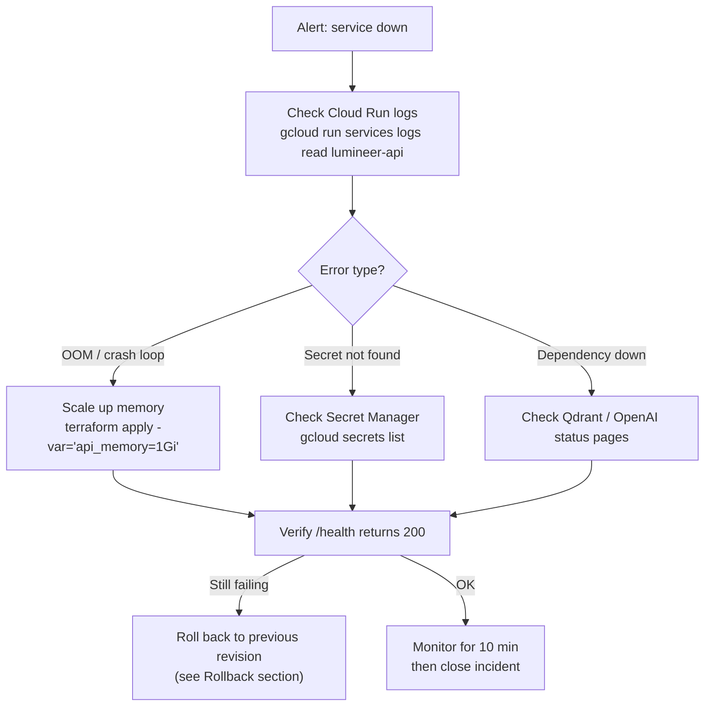

# Operations Guide

This guide covers day-to-day operations: monitoring, alerting, incident response, and routine maintenance.

---

## Observability Stack

Lumineer runs a 3-layer observability strategy.

| Tool | Role | Environment |
|------|------|-------------|
| **Langfuse** | LLM tracing — prompt I/O, token costs, agent execution flow | Dev (Docker) / optionally Langfuse Cloud |
| **Prometheus** | Metrics scraping — latency, error rate, token consumption | Dev (Docker) / GCP Cloud Monitoring in prod |
| **Grafana** | Dashboards and alerting | Dev (Docker) / Cloud Run in prod |
| **DeepEval** | RAG quality evaluation against Golden Dataset | Batch (local) |



---

## Starting the Observability Stack (Local)

```bash
# Start infra + observability (no app services)
docker compose --profile observability up -d

# Verify all containers are running
docker compose ps
```

Service URLs:

| Service | URL | Credentials |
|---------|-----|-------------|
| Grafana | http://localhost:3100 | admin / admin |
| Langfuse | http://localhost:3030 | Set on first login |
| Prometheus | http://localhost:9090 | — |

---

## Grafana Dashboards

Dashboards are provisioned as code in `grafana/provisioning/dashboards/`. They load automatically on container start.

### Available Dashboards

| Dashboard | Panels | Use When |
|-----------|--------|----------|
| **API Overview** | Request rate, p50/p95/p99 latency, error rate by route | Investigating slow responses |
| **AI Processing** | Agent run duration, tool call counts, token consumption | Debugging agent behavior |
| **Qdrant** | Search latency, index size, memory usage | RAG performance tuning |
| **Cost Tracker** | Daily/monthly token spend by model | Budget monitoring |

### Key Metrics to Watch

```
# Request latency (target: p95 < 3s for search, p95 < 1s for auth)
histogram_quantile(0.95, rate(http_request_duration_seconds_bucket[5m]))

# Error rate (target: < 1%)
rate(http_requests_total{status=~"5.."}[5m]) / rate(http_requests_total[5m])

# AI Processing cold starts
rate(cold_start_total[10m])

# Token consumption by model
rate(tokens_used_total[1h])
```

---

## Langfuse — LLM Tracing

### Viewing Traces

1. Open http://localhost:3030
2. Navigate to **Traces** to see individual agent runs
3. Click a trace to see the full execution graph:
   - Triage Agent → Specialist Agent handoff
   - Tool calls (`search_courses`, `analyze_skill_gap`, `generate_learning_path`)
   - Raw prompt/response for each step
   - Token count and latency per step

### Reading a Trace

```
Trace: user_query="Find Python courses for beginners"
├── Triage Agent                     23ms   tokens: 412
│   └── handoff → Search Agent
└── Search Agent                    1,843ms  tokens: 2,104
    ├── search_courses(query="Python", level="Beginner")
    │   ├── embed(query)             180ms
    │   ├── hybrid_search()          95ms
    │   └── rerank()                 3ms
    └── LLM response generation     1,565ms
```

### Monitoring for Issues in Langfuse

| Signal | Threshold | Action |
|--------|-----------|--------|
| Guardrail trigger rate | > 5% | Review recent inputs for injection attempts |
| Hallucination checker blocks | > 2% | Check prompt / context quality |
| Average tokens per request | > 8,000 | Formatter may be sending too much context |
| Agent run duration | > 10s | Check for Corrective RAG loops |

---

## Alerting

### Grafana Alert Rules

Alerts are defined in `grafana/provisioning/alerting/`. Key rules:

| Alert | Condition | Severity | Notification |
|-------|-----------|----------|--------------|
| High error rate | 5xx rate > 5% for 2m | Critical | — |
| Slow search | p95 latency > 5s for 5m | Warning | — |
| AI cold start spike | > 5 cold starts/min | Info | — |
| Token budget exceeded | Daily spend > $5 | Warning | — |

> Notification channels (Slack, email) are configured in Grafana → Alerting → Contact Points.

---

## Health Checks

Each service exposes a `/health` endpoint.

```bash
# Gateway
curl http://localhost:3000/health
# → {"status":"ok","service":"gateway"}

# Backend
curl http://localhost:3001/health
# → {"status":"ok","service":"backend","db":"connected"}

# AI Processing
curl http://localhost:8001/health
# → {"status":"ok","service":"ai","qdrant":"connected","model":"gpt-4o-mini"}
```

In production, Cloud Run performs liveness and startup probes against `/health` automatically (configured in `infra/cloud_run.tf`).

---

## Incident Response

### Severity Levels

| Level | Description | Response Time |
|-------|-------------|---------------|
| **P1** | Service completely down, all users affected | Immediate |
| **P2** | Degraded — search or chat returning errors for > 10% requests | < 30 min |
| **P3** | Performance degraded but functional | < 2 hours |
| **P4** | Minor issue, workaround available | Next business day |

---

### P1 Runbook: Service Down



**Immediate triage commands:**

```bash
# Check service status
gcloud run services describe lumineer-api --region=asia-northeast1

# Tail live logs
gcloud run services logs tail lumineer-api --region=asia-northeast1

# Check recent revisions
gcloud run revisions list --service=lumineer-api --region=asia-northeast1
```

---

### P2 Runbook: AI Processing Errors

**Symptoms**: Search or chat returning 5xx, Langfuse showing failed agent runs.

```bash
# 1. Check AI Processing logs
gcloud run services logs read lumineer-ai --region=asia-northeast1 --limit=50

# 2. Check Qdrant connectivity from AI service
# (look for "qdrant connection failed" in logs)

# 3. Check OpenAI API status
# https://status.openai.com

# 4. If Qdrant issue: verify Qdrant Cloud cluster is running
# Qdrant dashboard: https://cloud.qdrant.io

# 5. Verify secrets are readable
gcloud secrets versions access latest --secret="lumineer-openai-api-key"
gcloud secrets versions access latest --secret="lumineer-qdrant-url"
```

**Common causes and fixes:**

| Symptom | Cause | Fix |
|---------|-------|-----|
| `OPENAI_API_KEY invalid` | Secret version mismatch | Update secret: `echo -n "sk-..." \| gcloud secrets versions add lumineer-openai-api-key --data-file=-` |
| `Qdrant connection refused` | Qdrant Cloud cluster paused (free tier) | Resume cluster from Qdrant Cloud dashboard |
| `Agent max turns exceeded` | Corrective RAG loop | Check prompt in `ai/app/prompts/search.md`, adjust AGENT_MAX_TURNS |
| `500 on all AI routes` | Python import error at cold start | Check startup logs for `ImportError` |

---

### Rollback Procedure

```bash
# 1. List revisions with traffic info
gcloud run revisions list --service=lumineer-api --region=asia-northeast1

# Output:
# REVISION                 ACTIVE  SERVICE       DEPLOYED
# lumineer-api-00015-xyz   yes     lumineer-api  2026-03-18T10:00:00
# lumineer-api-00014-abc   no      lumineer-api  2026-03-17T09:00:00

# 2. Route all traffic to previous revision
gcloud run services update-traffic lumineer-api \
  --to-revisions=lumineer-api-00014-abc=100 \
  --region=asia-northeast1

# 3. Verify rollback
curl https://<gateway-url>/health

# 4. Fix the issue in code, push a new revision, then re-route
```

---

## Log Management

### Log Access

```bash
# All logs (last 1 hour)
gcloud logging read "resource.type=cloud_run_revision" \
  --freshness=1h \
  --format="json"

# Only errors
gcloud logging read \
  "resource.type=cloud_run_revision AND severity>=ERROR" \
  --freshness=1h

# Specific service
gcloud logging read \
  "resource.labels.service_name=lumineer-ai" \
  --freshness=30m
```

### Log Format

All services emit structured JSON logs:

```json
{
  "timestamp": "2026-03-18T10:00:00Z",
  "level": "info",
  "service": "ai-processing",
  "trace_id": "abc123",
  "message": "Agent run completed",
  "agent": "search_agent",
  "duration_ms": 1843,
  "tokens": 2104
}
```

---

## Routine Maintenance

### Weekly

- [ ] Review Langfuse: guardrail trigger rate, average token cost per request
- [ ] Review Grafana: error rate trends, p95 latency trends
- [ ] Check Cloud Run billing in GCP Console

### Monthly

- [ ] Rotate secrets if needed (`gcloud secrets versions add ...`)
- [ ] Review Golden Dataset: add new edge cases found in production traces
- [ ] Run RAG evaluation: `cd ai && uv run python scripts/run_evals.py`
- [ ] Review Cloud Run scaling settings (adjust `min_instances` for demo seasons)

### Before a Demo

```bash
# 1. Warm up AI Processing to avoid cold start
gcloud run services update lumineer-ai \
  --min-instances=1 \
  --region=asia-northeast1

# 2. Seed Qdrant if data was lost
cd ai && uv run python scripts/seed_data.py

# 3. Smoke test all agents
curl -X POST https://<gateway-url>/api/search \
  -H "Content-Type: application/json" \
  -d '{"query": "Python beginner courses"}'

# 4. After demo — reset min-instances to 0
gcloud run services update lumineer-ai \
  --min-instances=0 \
  --region=asia-northeast1
```

---

## RAG Quality Monitoring

### Running the Evaluation

```bash
cd ai
uv run python scripts/run_evals.py
```

Output example:

```
=== RAG Evaluation Results ===
Dataset: evals/datasets/golden_dataset.json (95 cases)
Reranker: none
Formatter: json

Tier 1 (CI/CD Gates):
  Hit Rate@10:   0.89  ✅ (threshold: 0.80)
  Hallucination: 0.02  ✅ (threshold: < 0.05)
  Faithfulness:  0.91  ✅ (threshold: 0.85)

Tier 2 (Strategy Comparison):
  MRR:           0.76
  NDCG@10:       0.81

Tier 3 (Guidance):
  Precision@10:  0.74
  Answer Relevancy: 0.88
```

### Interpreting Degraded Scores

| Metric drops | Likely cause | Investigation |
|-------------|--------------|---------------|
| Hit Rate@10 | Embedding drift, Qdrant collection corrupt | Re-seed: `uv run python scripts/seed_data.py` |
| Faithfulness | Prompt change causing hallucinations | Review `prompts/search.md`, add stronger constraints |
| Hallucination rises | New data in Qdrant with mismatched schema | Check `scripts/seed_data.py` output fields |

---

## Cost Monitoring

### Token Budget Alerts

Set `MAX_TOKENS_PER_REQUEST` in `ai/app/config/settings.py` to cap per-request spend.

### Monthly Cost Tracking

```bash
# Export token usage from Langfuse (if using Langfuse Cloud)
# Or check Prometheus metric: tokens_used_total

# GCP billing breakdown
gcloud billing projects describe <project-id>
```

Expected monthly spend (demo load):

| Item | Cost |
|------|------|
| Cloud Run (all services) | $0 (free tier) |
| Firebase Hosting | $0 |
| Qdrant Cloud (1GB) | $0 |
| OpenAI GPT-4o-mini | ~$5 |
| OpenAI Embeddings (one-time ingestion) | ~$0.26 |
| **Total** | **~$5–6/month** |
