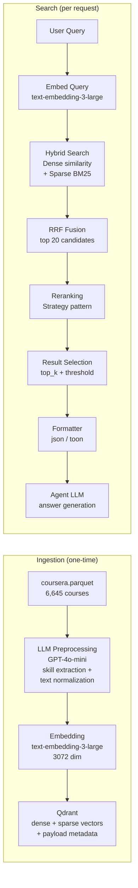
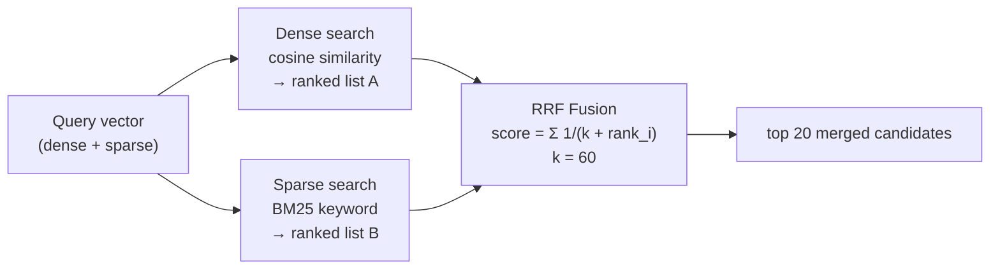
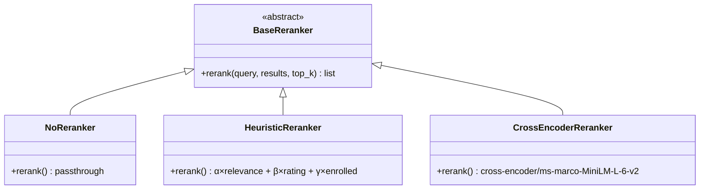
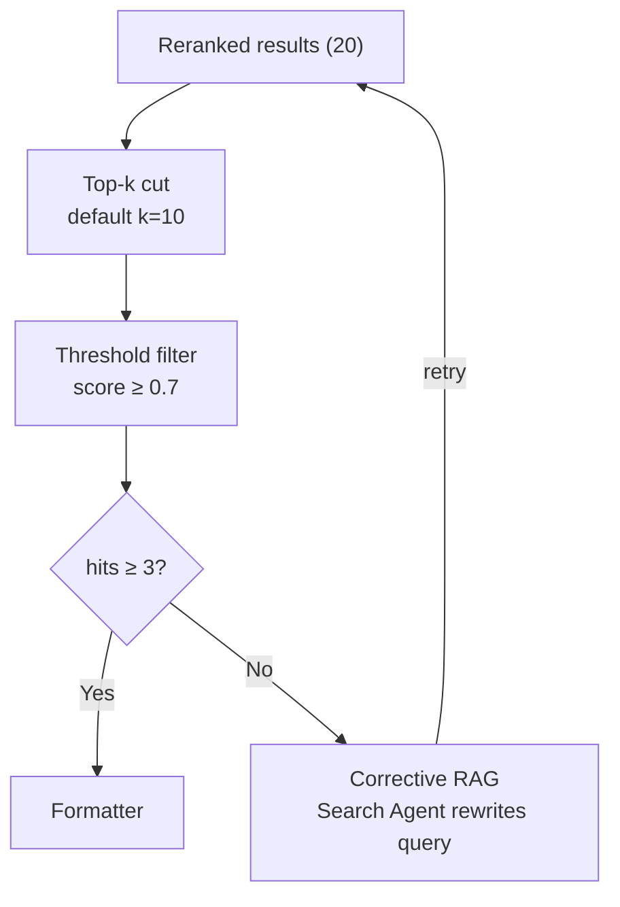
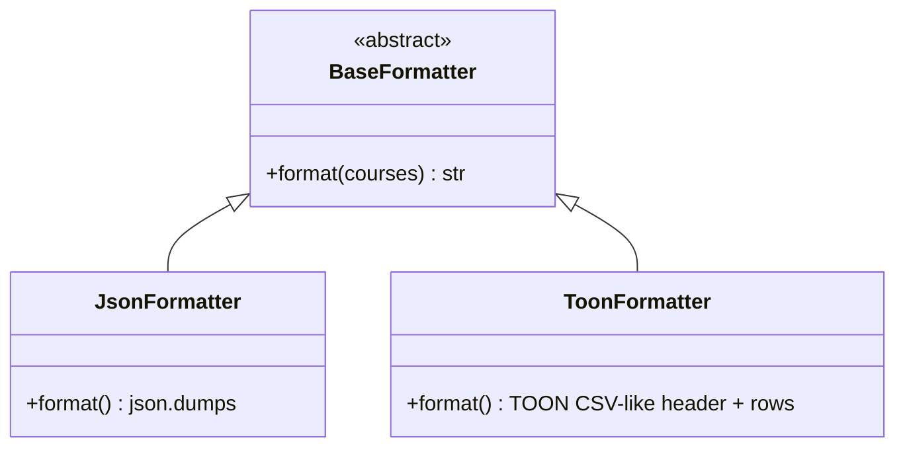

# RAG Pipeline

Lumineer uses a custom RAG (Retrieval-Augmented Generation) pipeline built from scratch — no LangChain. This document covers every step from data ingestion to context delivery.

---

## Pipeline Overview



---

## Step 1 — Data Ingestion

### Source data

- **File:** `data/raw/coursera.parquet` (11.4 MB)
- **Courses:** 6,645
- **Key issue:** Skills field is empty for 29% of courses; Description averages 3,198 chars

### LLM Preprocessing (GPT-4o-mini)

Each course is sent to GPT-4o-mini to generate a clean, search-optimized `search_text` field:

```
Input:  title, description (raw, up to 32K chars), skills (may be empty)
Output: search_text — normalized, keyword-rich summary with inferred skills
```

**Why preprocessing?**
- Fills in missing skills (29% of records)
- Compresses long descriptions into search-dense text
- Eliminates boilerplate marketing language that harms embedding quality

**Cost:** ~$1.10 (one-time)

### Embedding

| Property | Value |
|----------|-------|
| Model | `text-embedding-3-large` |
| Dimensions | 3072 |
| Input | `search_text` (LLM-generated) |
| Cost | ~$0.26 (one-time) |
| Storage | ~80 MB (within Qdrant Cloud 1 GB free tier) |

Both **dense** and **sparse** vectors are generated per course:
- **Dense:** floating-point semantic vector via OpenAI API
- **Sparse:** BM25-style keyword index (via Qdrant's built-in sparse vector support)

### Running ingestion

```bash
cd ai
uv run python scripts/seed_data.py
```

The script is idempotent — it skips already-processed courses.

---

## Step 2 — Query Embedding

At search time, the user query is embedded with the same model:

```python
embedding = await openai_client.embeddings.create(
    input=query,
    model="text-embedding-3-large",
    dimensions=3072
)
```

A sparse representation is also generated for BM25 keyword matching.

---

## Step 3 — Hybrid Search

Qdrant performs dense and sparse search in a single request using **Reciprocal Rank Fusion (RRF)**:



**Why RRF over weighted linear combination?**

Dense and sparse scores have incompatible scales. RRF works purely on rank positions, requiring no normalization. Qdrant supports this natively — zero extra implementation cost.

### Metadata filtering

Filters are applied *before* vector search (pre-filtering) so the vector search only considers matching documents:

| Filter | Type | Example |
|--------|------|---------|
| `level` | exact match | `"Beginner"` |
| `organization` | exact / match_any | `"Stanford University"` |
| `rating` | range `≥ N` | `min_rating=4.5` |
| `skills` | match_any | `["Python", "TensorFlow"]` |

Missing `level` values (12% of courses) are included in filtered results to avoid surfacing false negatives.

---

## Step 4 — Reranking (Strategy Pattern)



| Strategy | Mechanism | Latency | Cost |
|----------|-----------|---------|------|
| `none` | Pass-through (default) | 0 ms | $0 |
| `heuristic` | `α × relevance + β × rating + γ × enrolled` | ~1 ms | $0 |
| `cross-encoder` | `cross-encoder/ms-marco-MiniLM-L-6-v2` (CPU) | +200–500 ms | $0 |

Switch at runtime via the Settings UI → `PUT /api/settings` → `{"reranker_strategy": "heuristic"}`. Takes effect on the next request, no restart required.

---

## Step 5 — Result Selection

After reranking:

1. **Top-k cut:** retain the top `k` results (default: 10, configurable in Settings)
2. **Threshold filter:** discard results with similarity score below `similarity_threshold` (default: 0.7)
3. **Corrective RAG:** if fewer than 3 results survive, the Search Agent rewrites the query and retries step 3



---

## Step 6 — Context Formatting (Strategy Pattern)

The formatter converts course objects into a string that fits efficiently into the agent's context window.



### JSON format (default)

```json
[
  {
    "title": "Machine Learning Specialization",
    "organization": "Stanford University",
    "level": "Beginner",
    "rating": 4.9,
    "enrolled": 1234567,
    "skills": ["Python", "Machine Learning", "Deep Learning"],
    "url": "https://www.coursera.org/..."
  }
]
```

### TOON format (~50% fewer tokens)

TOON (Token-Oriented Object Notation) uses a single header row and CSV-like data rows:

```
courses[3]{title,org,level,rating,enrolled,skills}:
  Machine Learning Specialization,Stanford University,Beginner,4.9,1234567,"Python, Machine Learning"
  Deep Learning Specialization,DeepLearning.AI,Intermediate,4.8,900000,"Neural Networks, CNN"
  NLP Specialization,DeepLearning.AI,Advanced,4.7,500000,"NLP, Transformers"
```

**Token comparison (10 courses, 6 fields):**

| Format | Approx. tokens | Notes |
|--------|---------------|-------|
| JSON | ~800 | Field names repeated per object |
| TOON | ~400 | Header once, data rows only |

Switch: `PUT /api/settings {"context_format": "toon"}`. Same budget → 2× more courses in context.

---

## Hallucination Prevention

The Search Agent's prompt (`prompts/search.md`) contains explicit constraints:

- Only recommend courses present in the search results
- Never invent course names, ratings, or descriptions
- Quote data values (rating, level, skills) exactly from the context

The output guardrail (`hallucination_checker.py`) validates that course names in the LLM response exist in the retrieved set.

---

## Configuration Reference

All RAG parameters can be changed at runtime via `PUT /api/settings`:

| Parameter | Default | Range / Values | Effect |
|-----------|---------|---------------|--------|
| `reranker_strategy` | `none` | `none` · `heuristic` · `cross-encoder` | Post-retrieval reranking |
| `context_format` | `json` | `json` · `toon` | LLM context serialization |
| `top_k` | `10` | `5` · `10` · `20` | Results returned to LLM |
| `similarity_threshold` | `0.7` | `0.5`–`0.9` | Minimum score cutoff |

Environment variable overrides (used in production):

```env
RERANKER_STRATEGY=heuristic
CONTEXT_FORMAT=toon
TOP_K=10
SIMILARITY_THRESHOLD=0.7
```
